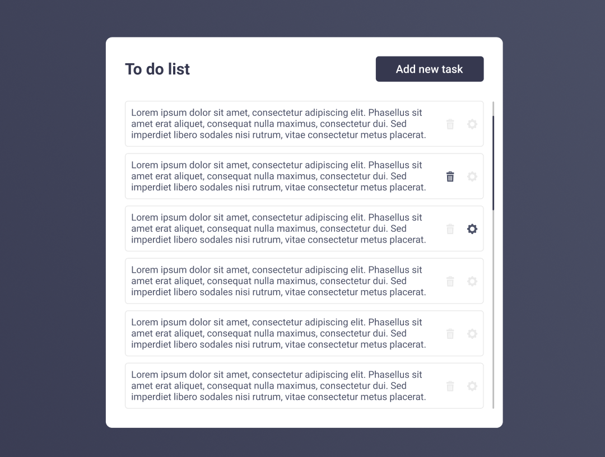

## CRUD - PHP, SCSS, Figma

Hi! I'm Florin Matei and you can see my entire work on **https://pixeltime.ro/**. I hope it will be useful that script for your project. 

## Files
CRUD (create-read-update-delete)

 1. Create - create.php 
 2. Read - index.php 
 3. Update - update.php 
 4. Delete - delete.php

## Database

In my example, the database is named "crud" and the table is "tasks". You will create your database in that way:

    CREATE TABLE IF NOT EXISTS `tasks` (
      `id` int(5) NOT NULL AUTO_INCREMENT,
      `text` longtext NOT NULL,
      PRIMARY KEY (`id`)
    ) ENGINE=MyISAM AUTO_INCREMENT=33 DEFAULT CHARSET=latin1;

 
The connection is set here:

    $db -> connect('localhost', 'root', '', 'crud');

## Figma Design

The User Interface Design is created using Figma. Also, in that repository you will find the .fig file (Figma file exported). If you want to update my design, enjoy it.

